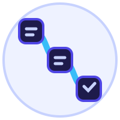

# TaskStitch

[English](./README.md) · [Español](./README.es.md) · **Português (BR)** · [Français](./README.fr.md) · [日本語](./README.ja.md)

**Captura qualquer fluxo no navegador e transforma num guia passo a passo. Sem conta, sem nuvem, sem rastreio.**

Clica em gravar, faz o que precisa, e recebe um guia caprichado com capturas de tela anotadas. Edita, reproduz ou exporta.

TaskStitch é um fork pessoal mantido de forma independente do [Mimik da Westpoint](https://github.com/westpoint-io/mimik). Ele preserva a base local e de código aberto, com captura entre sites, etapas manuais com texto rico, revisão explícita de IA, saída em japonês e melhorias de confiabilidade. TaskStitch não é afiliado nem endossado pela Westpoint.

<!-- SHIELD GROUP -->

[![License][license-shield]][license-link]
[![Manifest V3][mv3-shield]][mv3-link]
[![100% Local][local-shield]][local-link]
[![No Account][no-account-shield]][no-account-link]
 
[![Stars][star-shield]][star-link]
[![Contributors][contributors-shield]][contributors-link]
![Last Commit][last-commit-shield]
[![Issues][issues-shield]][issues-link]

<kbd>Sumário</kbd>

#### TOC

- [👋 Começando](#-começando)
- [✨ Funcionalidades](#-funcionalidades)
  - [🎬 Captura automática](#-captura-automática)
  - [📸 Capturas anotadas](#-capturas-anotadas)
  - [🔒 Smart Blur](#-smart-blur)
  - [🧠 Melhorar guia com IA (opcional)](#-melhorar-guia-com-ia-opcional)
  - [▶️ Reprodução Guide Me](#️-reprodução-guide-me)
  - [📤 Exportação multi-formato](#-exportação-multi-formato)
  - [🌍 Multi-idioma](#-multi-idioma)
  - [💾 Armazenamento 100% local](#-armazenamento-100-local)
- [🤝 Contribuir](#-contribuir)
- [📜 Licença](#-licença)

 

## 👋 Começando

O TaskStitch transforma qualquer tarefa repetitiva do navegador num guia documentado e compartilhável em segundos. Roda inteiro dentro do teu navegador, sem backend, conta ou telemetria. Os dados ficam no teu dispositivo, exceto quando tu executa explicitamente Melhorar guia, que informa o texto e as capturas representativas opcionais enviados direto ao provedor escolhido.

Seja documentando ferramentas internas, escrevendo tutoriais do produto, ou integrando um colega novo, o TaskStitch captura cada clique, tecla e navegação automaticamente pra tu focar no que importa.

| Navegador | Versão upstream | Instalação upstream |
| --------- | --------------- | -------------------- |
| Chrome    | [![Chrome Version][chrome-version-shield]][chrome-link]   | [Chrome Web Store][chrome-link] |
| Firefox   | [![Firefox Version][firefox-version-shield]][firefox-link] | [Firefox Add-ons][firefox-link]  |

> [!NOTE]
>
> As versões nas lojas são mantidas pelo projeto upstream e podem ainda não incluir os recursos específicos deste fork. Para executar a versão atual deste repositório, segue as instruções de desenvolvimento ou compilação em [CONTRIBUTING.md](./CONTRIBUTING.md).

> \[!IMPORTANT]
>
> **⭐️ Dá uma estrela no repo** se o TaskStitch te economiza tempo. Ajuda outras pessoas a descobrirem ele.

[![Back to top][back-to-top]](#readme-top)

## ✨ Funcionalidades

### 🎬 Captura automática

Clica, digita, navega. O TaskStitch vê tudo. Cada ação relevante vira um passo: cliques em botões e links, campos de formulário, atalhos de teclado, área de transferência, arrastar e soltar, e navegações.

A fusão inteligente de eventos descarta os cliques rápidos em elementos próximos, pra teus guias ficarem limpos. A interceptação do clique acontece *antes* da página mudar, então nada se perde em SPAs nem em recarregamentos completos.

Inicia ou para a gravação de qualquer lugar com <kbd>Ctrl</kbd>+<kbd>Shift</kbd>+<kbd>R</kbd>, ou <kbd>Command</kbd>+<kbd>Shift</kbd>+<kbd>R</kbd> no macOS.

Pausa a gravação, troca para outro site HTTP ou HTTPS e retoma para documentar fluxos multi-plataforma num único guia. O TaskStitch segue a aba ativa, preserva a URL de origem e rejeita eventos atrasados de abas anteriores.

[![Back to top][back-to-top]](#readme-top)

### 📸 Capturas anotadas

Cada passo capturado pode incluir uma imagem com o elemento clicado destacado e ampliado. Também dá para inserir em qualquer posição um passo manual com texto rico, uma imagem importada ou ambos. Imagens PNG, JPEG e WebP são decodificadas e recodificadas localmente para remover metadados.

Todos os passos aceitam negrito, itálico, sublinhado, código em linha, links seguros, listas e desfazer/refazer. A formatação é preservada na exportação.

[![Back to top][back-to-top]](#readme-top)

### 🔒 Smart Blur

O TaskStitch detecta e desfoca dados sensíveis automaticamente nas tuas capturas: e-mails, telefones, CPFs, cartões de crédito, IPs, endereços MAC. Liga ou desliga cada categoria do jeito que tu quiser.

Precisa esconder algo específico? O seletor manual deixa tu escolher qualquer elemento do DOM e mascarar ele em todas as capturas onde aparecer.

[![Back to top][back-to-top]](#readme-top)

### 🧠 Melhorar guia com IA (opcional)

A gravação nunca chama a IA. O TaskStitch cria descrições locais e um título determinístico. Depois, tu pode executar **Melhorar guia** para pedir um título e descrições mais específicos, revisando e escolhendo cada mudança antes de aplicar.

Usa tua própria chave da OpenAI ou Anthropic, um modelo predefinido ou personalizado e, opcionalmente, uma URL base compatível. A solicitação exclui valores digitados, credenciais, JSON de texto rico e passos manuais.

A análise de capturas fica desligada por padrão. Se tu ativar para uma solicitação, o TaskStitch mostra o provedor, o modelo e o número exato de imagens antes de enviar até oito capturas representativas, reduzidas localmente e com os desfoques salvos. Se o modelo rejeitar imagens, dá para tentar novamente explicitamente só com texto.

[![Back to top][back-to-top]](#readme-top)

### ▶️ Reprodução Guide Me

Reproduz qualquer guia ao vivo numa página real. O TaskStitch destaca o próximo elemento, marca teu progresso passo a passo, e avança sozinho conforme tu vai interagindo. Perfeito pra integrar colegas ou pra se guiar num processo tu mesmo.

[![Back to top][back-to-top]](#readme-top)

### 📤 Exportação multi-formato

Compartilha os guias no formato que melhor cabe no teu fluxo:

- **HTML**: autônomo, compartilha em qualquer lugar, imagens embutidas em base64
- **PDF**: pronto pra imprimir, A4 retrato com quebras de página automáticas e capturas anotadas
- **Markdown**: cola no Notion, GitHub, docs internas, wikis

Todas as exportações são geradas no cliente. Nada passa por servidor.

[![Back to top][back-to-top]](#readme-top)

### 🌍 Multi-idioma

A interface está disponível em inglês, espanhol, português brasileiro e francês. O idioma de saída da IA é configurado separadamente e também aceita japonês, então tu pode usar o TaskStitch em inglês e gerar guias em japonês.

[![Back to top][back-to-top]](#readme-top)

### 💾 Armazenamento 100% local

Teus guias, conteúdo rico, capturas, chaves de API e URLs compatíveis ficam no teu dispositivo. Sem backend, conta nem telemetria. Só uma solicitação explícita de Melhorar guia envia o texto informado e, quando habilitadas separadamente, capturas representativas ao provedor configurado. Nenhum servidor do TaskStitch recebe esses dados.

[![Back to top][back-to-top]](#readme-top)

## 🤝 Contribuir

Todo tipo de contribuição é bem-vinda: relatos de bug, ideias novas, PRs e traduções.

Olha o [CONTRIBUTING.md](./CONTRIBUTING.md) pro setup de dev, a estrutura do projeto, e as diretrizes pra contribuidores.

[![Back to top][back-to-top]](#readme-top)

## 📜 Licença

TaskStitch é um fork independente do [Mimik da Westpoint](https://github.com/westpoint-io/mimik), distribuído sob a licença MIT. O aviso de copyright e a licença originais da Westpoint são preservados em [LICENSE](./LICENSE).

[![Back to top][back-to-top]](#readme-top)

<!-- LINK GROUP -->

[back-to-top]: https://img.shields.io/badge/-BACK_TO_TOP-1E1B4B?style=flat-square

[license-shield]: https://img.shields.io/badge/license-MIT-4F46E5?style=flat-square&labelColor=1E1B4B
[license-link]: ./LICENSE

[mv3-shield]: https://img.shields.io/badge/manifest-v3-3730A3?style=flat-square&labelColor=1E1B4B
[mv3-link]: https://developer.chrome.com/docs/extensions/mv3/intro/

[local-shield]: https://img.shields.io/badge/storage-100%25%20local-4F46E5?style=flat-square&labelColor=1E1B4B
[local-link]: #-armazenamento-100-local

[no-account-shield]: https://img.shields.io/badge/account-not%20required-4F46E5?style=flat-square&labelColor=1E1B4B
[no-account-link]: #-armazenamento-100-local

[star-shield]: https://img.shields.io/github/stars/mitchellTsukaeru/taskstitch?style=flat-square&label=stars&color=4F46E5&labelColor=1E1B4B
[star-link]: https://github.com/mitchellTsukaeru/taskstitch/stargazers

[contributors-shield]: https://img.shields.io/github/contributors/mitchellTsukaeru/taskstitch?style=flat-square&labelColor=1E1B4B
[contributors-link]: https://github.com/mitchellTsukaeru/taskstitch/graphs/contributors

[last-commit-shield]: https://img.shields.io/github/last-commit/mitchellTsukaeru/taskstitch?style=flat-square&label=commit&labelColor=1E1B4B

[issues-shield]: https://img.shields.io/github/issues/mitchellTsukaeru/taskstitch?style=flat-square&labelColor=1E1B4B
[issues-link]: https://github.com/mitchellTsukaeru/taskstitch/issues

[chrome-version-shield]: https://img.shields.io/chrome-web-store/v/jmfohdaflahliammccpiadmkcibohgha?label=Chrome%20Version&style=flat-square&logo=googlechrome&logoColor=C7D2FE&color=4F46E5&labelColor=1E1B4B
[chrome-link]: https://chromewebstore.google.com/detail/mimik/jmfohdaflahliammccpiadmkcibohgha
[firefox-version-shield]: https://img.shields.io/amo/v/mimik?label=Firefox%20Version&style=flat-square&logo=firefoxbrowser&logoColor=C7D2FE&color=4F46E5&labelColor=1E1B4B
[firefox-link]: https://addons.mozilla.org/en-US/firefox/addon/mimik/
